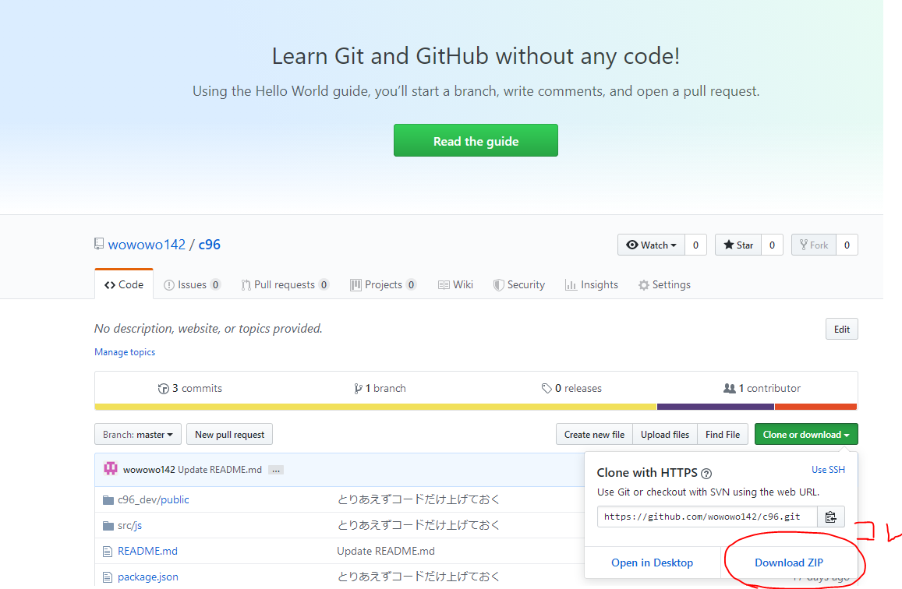
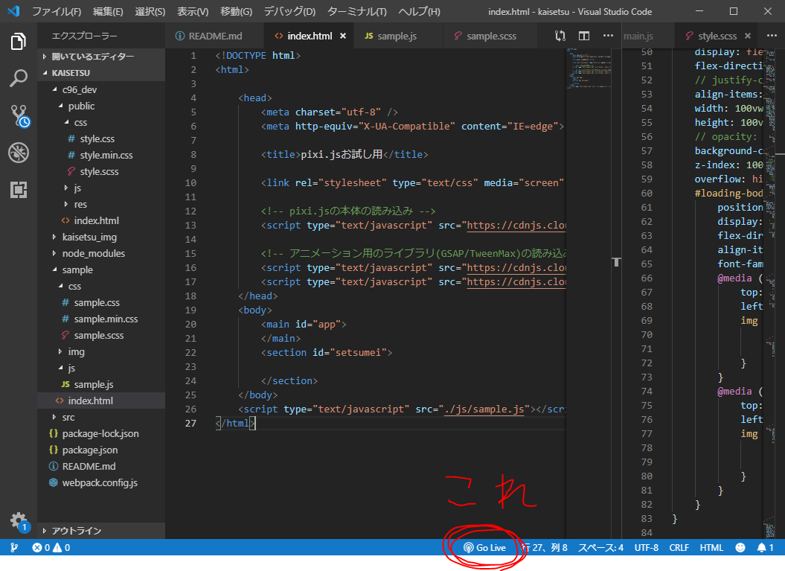
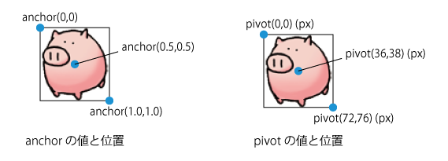
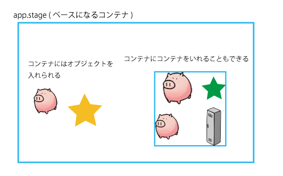
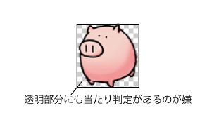
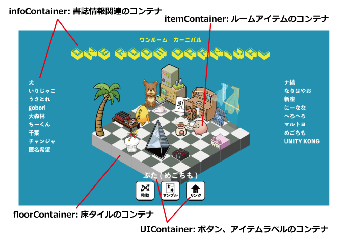
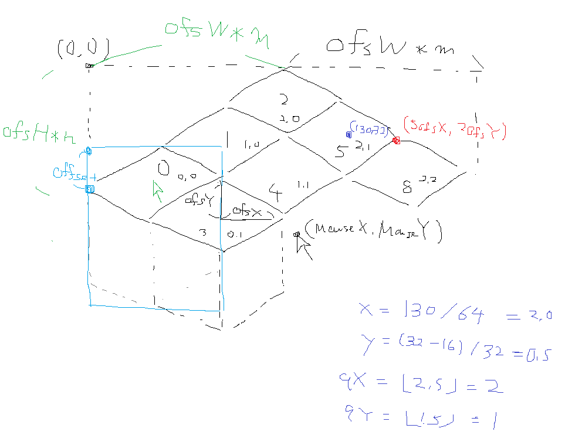
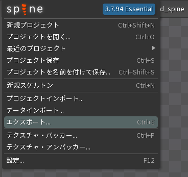
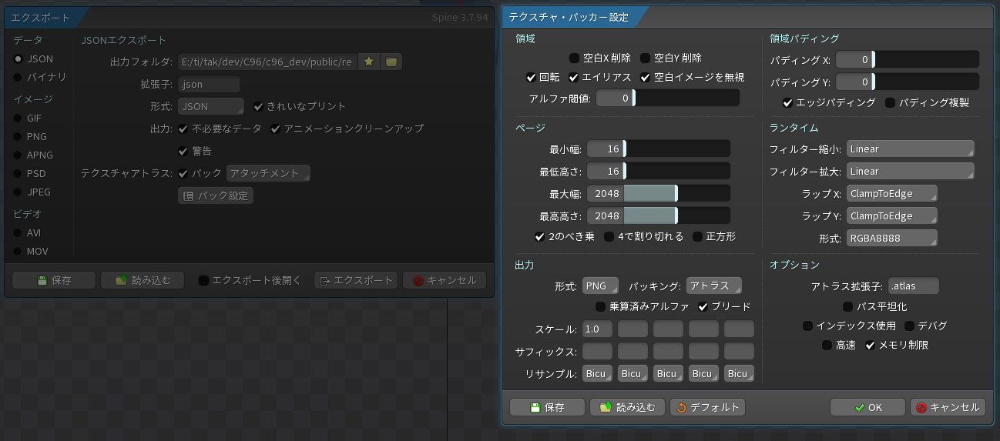

<span style="font-size:0.85rem">この解説のテキストは誰でも自由に複製・転載してくださって構いませんが、筆者は内容の正確性を100%保証せず、利用によって生じた問題・不利益について筆者は責任を負いません.</span>  


# 初心者による超初心者のためのPixiJS入門
#### (+ルーム風機能の実装解説)  
書いた日: 2019/09/01 


## 何これ？誰お前？

地井 a.k.a. たけを(ex.wowowo142)です。 [(誰？)](https://twitter.com/chiisanwo)  
C96でめごちもさんが発行した合同誌の[告知ページ](http://amaai-poconuts.com/c96/)をPixiJSを使って作りました。  

このページでは↓のことを解説していきます 

* <a href="#1">PixiJS(v5)の基礎</a>
* <a href="#2">(おまけ1)ルーム風機能の概要・実装のポイント</a>
* <a href="#3">(おまけ2)SpineアニメーションをPixiで動かす(プラグインの使い方)</a>

想定読者は、JavaScriptやFlash(ActionScript)の知識が少しあってぐりぐり動かせるWebサイトを作ったりしてみたい人(～PixiJSの基礎)、なんとなくJavaScript(ES6)が書けて告知サイトの実装が気になる人(ルーム機能～)です。 

## なんで書いた？

Flashがもうすぐ(来年末)死んじゃうらしいので。(なんだかんだ生き延びる気もしますが...)  

Flashからの乗り換え先としてわりとよさげ(Flash未経験なので信憑性無)なPixiですが、登場からの年月、知名度のわりに初心者向けの日本語記事があまりありません。人気ないんでしょうか。  
また、Pixiはバージョンアップでお作法がけっこう変わる部分があり、数年前の記事に載っているコードではうまく動作しないことがしばしばあります(この解説もそのうち使えなくなりそう)。  

そのため、現在(2019年8月)Flashからの乗り換えを検討している人や、これからWebアニメーションを始めたい初心者の助けになればと思って書きました。(当初はルーム風機能の実装解説メインのつもりでしたが需要なさそうなので変えました)  

自分は今回初めてちゃんとWebアニメーションに触れ、それまでFlash等の経験も皆無だったため、セオリーから外れる部分や何年前の話してんの？という部分があるかもしれませんが、多めに見ていただきつつ、よければご指摘いただければありがたいです。    

<br>

## <span id="1">1. PixiJS(v5)の基礎</span>

#### <a href="#1-1">1.1 PixiJS is 何</a>
#### <a href="#1-2">1.2 開発環境を作る</a>
#### <a href="#1-3">1.3 Pixiアプリケーションを生成する</a>
#### <a href="#1-4">1.4 スプライトや図形を表示する</a>
#### <a href="#1-5">1.5 コンテナを作ってオブジェクトをまとめる</a>
#### <a href="#1-6">1.6 オブジェクトがクリックされたときになんかする</a>
#### <a href="#1-7">1.7 オブジェクトをドラッグして動かす</a>
#### <a href="#1-8">1.8 オブジェクトの前後関係(描画順序)を変更する</a>
#### <a href="#1-9">1.9 毎フレーム何らかの処理を実行する</a>
#### <a href="#1-10">1.10 キーボードが押されたときにオブジェクトを動かす</a>
#### <a href="#1-11">~1.11 パラパラ(フレーム)アニメーションするスプライトを作る~</a>
#### <a href="#1-12">1.12 Tickerを使わずにアニメーションする(別ライブラリを併用)</a>
#### <a href="#1-13">1.13 テキストを表示する(+外部フォントの適用)</a>
#### <a href="#1-14">1.14 点とオブジェクトの衝突判定</a>
#### <a href="#1-15">1.15 オブジェクトの衝突判定領域をカスタマイズする</a>


<br>

### <span id="1-1">1.1 PixiJS is 何</span>  
**初心者向けの説明**  
[PixiJS](https://www.pixijs.com/)(以下Pixi)はブラウザ上で、様々な2Dグラフィックス処理を実現するためのJavaScriptライブラリです。商用でも無償で使用できます(MITライセンス)。  
アイマスPに身近なものでは、アイドルマスターシャイニーカラーズ(以下シャニマス)のゲームエンジンenza-game.jsのグラフィックス部分にPixiが採用されています(2019/8現在)。<span style="font-size:0.85rem">[※参考記事](https://www.gamer.ne.jp/news/201808240094/)</span>  
<span style="font-size:0.9rem">ちなみに、シャニマスのキャラモーションには[Spine](http://ja.esotericsoftware.com/)が採用されています。PixiでSpineを利用する方法についても、このコーナーのおまけ部分で解説します。</span>

**Pixiでできること**
* オブジェクト(スプライトや図形)の描画
* オブジェクトのアニメーション(移動・回転・パラパラアニメーション)
* フィルター処理
* オブジェクトとのインタラクション(クリックやドラッグといったユーザー操作の検知)

**Pixiのメリット**
* 処理の記述が(ライブラリを使用しない場合に比べて)簡単
* スマホでも動く
* 内部ですごい最適化をしているので軽い<span style="font-size:0.85rem">(実際はWebGLのメリット)</span>
* 演算処理にGPU(≒グラボ)を利用できるため、ハードの性能を活かせる(≒軽い)

**Pixiのデメリット**
* 日本語ドキュメントが少ない(なんなら英語も多くない)
* 未だ不完全な部分もある(更新頻度は高い/反面仕様が変わる場合がある)

Pixiはゲームエンジンではないので、ゲーム制作のためには機能不足な面があります(ex:物理演算)。Pixiをグラフィックス部分に使用した2Dゲームエンジンとして、[Phaser](https://phaser.io/)があるので、手っ取り早くスマホ対応ブラウザゲームを作りたい方は見てみるといいかもしれません。<span style="font-size:0.85rem">※筆者は使ったことないです。詳しいことはググってください。</span>

また、Pixiは3Dグラフィックスのためのライブラリではありません([できないとは言ってない](https://lumina.goodboydigital.com/))。3Dがやりたい人は、[three.js(入門サイトリンク)](https://ics.media/tutorial-three/)を試してみてください。
&nbsp;

**ちょっと知ってる人向けの補足(よく分からんかったら読み飛ばしても大丈夫)**  
PixiはWebGLのラッパーです。飛んでそうな疑問にここでいくつか回答しておきます。

Q. WebGLって3D描画のためのものじゃないの？  
A. おっしゃる通りWebGL(とその土台のOpenGL等)は一般的に3Dグラフィックスの高速処理を目的に利用されるAPI規格ですが、2Dグラフィックスに使えないということはありません(当たり前っちゃ当たり前ですが...)。

Q. パーティクルがぶわーとかフィルタがぐわーみたいな重い描画に使うならわかるけど、その告知ページ程度の描画にWebGLいる？    
A. たしかに。比較してないので分かりませんが、WebGL非対応の既存2Dライブラリで実装しても大して処理速度は変わらんのではないかと思います。ただ、素のWebGLだったらわざわざ使うにはハードルが高すぎるのでやりませんが、Pixiはざっと見他の人気ライブラリと同じくらい利用が容易ですし本体も350KB程度とそれほど重くなく、難易度が同じで(潜在的な)処理性能が高いならそっちがいいかなという感じです。<span style="font-size:0.85rem">あと単にPixiやってみたかった。</span>

Q. スマホでどこまでできる？  
A. 数年前の端末だとシャニマスくらいがギリギリなんだと思います(内部でさらに最適化する前提)。告知ページ程度のオブジェクト数なら割とまともに動きます(端末熱くなるけど。実装が悪い説)。

Q. 端末(ブラウザ,OS)がWebGL未対応なんですが  
A. v5より前のバージョンか、`pixi-legacy.js`を使うとCanvas2Dへのフォールバックが有効になるっぽいです。[参考](https://medium.com/goodboy-digital/pixijs-v5-lands-5e112d84e510)("First-Class WebGL"のあたり)

Q. WebGPUがメジャーになったら死ぬ  
A. Pixiが対応してくれるでしょうきっと...。どんな規格やライブラリもいつか死ぬ(でもとりあえず数年は大丈夫そう)。

Q. Flashでいいです  
A. なんだかんだ生き残りそうだよね。iOSとかいうスカした奴は無視。

Q. 他のHTML5(Canvas 2D, WebGL)ライブラリでいいです  
A. いいのあったら教えてほしいです。

Q. UnityのWebGL(+WebAssembly)ビルドでいいです  
A. 本体が重くない？ロード画面って消せるんでしたっけ。ゲームなら全然いいと思います(低能なのでTinyUnityには手出せてません)。  

<br><br>
### <span id="1-2">1.2 開発環境を作る</span>
前置きが長いと怒られそうですが、まだ前置きです。  
実際にサンプルを見ていく前に、サンプルを動かす環境を作りましょう(分かる人はこの項全て読み飛ばして大丈夫です)。  

Pixiを使ったプログラムを動かすには、サーバーが必要となります。  
サーバーなんて持ってない...立てられない...という人でも大丈夫です。最近のエディタは拡張機能で簡易サーバーを立てることができるので、それを使いましょう。ちょっと面倒な作業ですが、がんばってください。  

※この解説ではVisual Studio Code(通称VSCode)というエディタを使用します。VSCode以外のエディタのセットアップ方法は解説しません。悪しからず。

1. VSCodeをインストールする  
公式サイトのダウンロード https://code.visualstudio.com/Download から、自分のOSに合ったインストーラーをダウンロードし、実行します。インストーラーにしたがってインストールしてください。  

2. 言語設定を変更する  
VSCodeを起動し、下の画像の赤丸のボタンをクリックして拡張機能の追加画面を開きます。<br><br>

  

<br>
検索窓が表示されるので、"Japanese Language Pack for Visual Studio Code
"と入力し、一番上に出てくるものの"install"をクリックします。これはMicrosoftが配布しているVSCodeの日本語化パッケージです。インストールが完了したら、一度VSCodeを再起動してください。  <br><br>
再起動したら、下の画像のように、[View]→[Command Palette]を選択します。  <br><br>

 

<br><br>
入力窓が表示されるので、`>Configure Display Language`と入力しエンターキーを押します。  
使用可能な言語の一覧が表示されるので、'ja'をクリックします。すると、再起動を促すダイアログが表示されるので、"restart"をクリックして再起動します。これでメニュー類が日本語されるはずです。   

3. 必要な拡張機能をインストールする  
インストールする拡張機能は下記のとおりです。
  * Live Server  
    VSCode内で起動できる簡易Webサーバー  
  * Easy Sass   
    SCSS(CSSの見やすい記法)ファイルを、保存時に自動的にCSSに変換してくれるやつ
どちらも日本語化パックをインストールしたときと同様に、拡張機能ボタンを押し、検索窓にそれぞれの名前を入力して一番上に出てきたものをインストールしてください。  <br>

最後に、この解説ページのトップから、サンプル一式をダウンロードしましょう。



画像の中段右にある緑色の"Clone or download"ボタンをクリックし、開いたメニューから"Download ZIP"をクリックして任意の場所に保存、zipを解凍します。  

解凍できたら、VSCodeを起動し、[ファイル] → [フォルダーを開く] で解凍したフォルダを開きます。

フォルダが開けたら、先ほどインストールしたLive Serverを起動しましょう。

 

画像の右下にある"Go Live"ボタンをクリックします。サーバーが起動すると、デフォルトのブラウザが起動し、このフォルダのトップページ(たいていは http://127.0.0.1:5500)が開くはずです。ボタンがない場合は、拡張機能インストールの手順を再確認してください。

 

おそらく、ブラウザには↑の画像のような画面が表示されていると思います。サンプルプログラムはこの中の"sample"フォルダで動かしますので、"sample"をクリックしてページを移動してください。

以上でサンプルの動作環境構築は完了です。

<br><br>
### <span id="1-3">1.3 Pixiアプリケーションを生成する</span>
準備ができたので、実際にサンプルを動かしていきましょう。  
この項ではオブジェクトを描画するための大枠部分を準備する手順を説明します。さっさと画像を表示したいしたいんですけど？という人は<a href="#1-4">飛ばして1.4に進んでも大丈夫です。</a>


まず、ブラウザで"sample"フォルダを開くと、水色の正方形が表示されているはずです。これは描画のための大枠部分を生成してHTMLに突っ込んだだけの状態です(分かりやすくするために背景色を設定しています)。
サンプルのHTML(`/sample/index.html`)はこんな感じ。  

```html
<!DOCTYPE html>
<html>
    <head>
        <meta charset="utf-8" />
        <meta http-equiv="X-UA-Compatible" content="IE=edge">
        
        <title>pixi.jsお試し用</title>

        <link rel="stylesheet" type="text/css" media="screen" href="./css/sample.css" />

        <!-- pixi.jsの本体の読み込み -->
        <script type="text/javascript" src="https://cdnjs.cloudflare.com/ajax/libs/pixi.js/5.0.1/pixi.min.js"></script>

        <!-- アニメーション用のライブラリ(GSAP/TweenMax)の読み込み -->
        <script type="text/javascript" src="https://cdnjs.cloudflare.com/ajax/libs/gsap/2.0.1/TweenMax.min.js"></script>
        <script type="text/javascript" src="https://cdnjs.cloudflare.com/ajax/libs/gsap/2.0.1/plugins/PixiPlugin.min.js"></script>
        <!-- 外部フォント読み込み用のライブラリの読み込み -->
        <script type="text/javascript" src="https://ajax.googleapis.com/ajax/libs/webfont/1.6.26/webfont.js"></script>
    </head>
    <body>
        <main id="app">
            <!-- ここにPixiの描画領域(Canvas)が入る -->
        </main>
    </body>
    <script type="text/javascript" src="./js/sample.js"></script>
</html>
```

いたってシンプルです。  

次に、JavaScriptでPixiアプリケーション(`PIXI.Application`オブジェクト、以下app)を生成し `<main id="app"> </main>` の中にappのビュー(描画領域)を突っ込む処理を見ていきたいところですが、その前に、`PIXI.Application`って何者？というところを解説します。  

`PIXI.Application`は、いくつかの基本的な機能が1まとめになった、Pixiを使った処理の土台です。とにもかくにも`PIXI.Application`を生成するところから始まります。  
下の表に`PIXI.Application`が持っている機能(メンバ)をまとめます。ざっと流し読みする程度で大丈夫です。  
それぞれの関係については、こちら [簡単アニメーション！Pixi.jsを触ってみる！（1）テキストを動かしてみる - Qiita](https://qiita.com/tadfmac/items/3684489e133320cd9d75) の記事の真ん中あたりにある図が分かりやすかったので、イメージを掴むために見てみるといいかもしれません。  
これらは古いバージョンではそれぞれバラバラに生成されていたようですが、たいていの処理で使うものとしてまとめられたようです。

|名前|概要|クラス(型)|  
|:--:|:--:|:--:|  
|view|ビュー。HTMLに挿入される\<canvas\>要素|HTMLCanvasElement|  
|stage|ステージ。画面に表示するオブジェクトたちの入れ物|PIXI.Container|
|screen|スクリーン。viewの大きさなどの情報を持っている|PIXI.Rectangle|
|以下は今は<br>無視してよい|||
|renderer|レンダラー。名前の通りレンダリングを担う|PIXI.Renderer or PIXI.CanvasRenderer|
|loader|ローダー。画像ファイルなどの読み込みを担う|PIXI.Loader|

このほかにも`PIXI.Application`が持つ機能はありますが、分かりにくくなるので割愛します。詳細が気になる人は公式リファレンスをどうぞ [PixiJS API Documentation - PIXI.Application](https://pixijs.download/dev/docs/PIXI.Application.html)。  

それでは、appを生成する処理を見ていきましょう。 `/sample/sample.js` の\/\*1.3\*\/とコメントがついている部分が該当処理です。  

```js
/**
 * 1.3 
 */
// Pixiアプリケーション生成
let app = new PIXI.Application({
    width: 600,     // スクリーン(ビュー)横幅 
    height: 600,    // スクリーン(ビュー)縦幅  
    backgroundColor: 0x1099bb,  // 背景色 16進 0xRRGGBB
});
// HTMLの<main id="app"></main>の中に上で作ったPIXIアプリケーション(app)のビュー(canvas)を突っ込む
let el = document.getElementById('app');
el.appendChild(app.view);
```

やってることは全てコメントに書いてある通りです。  
一応少し補足すると、HTMLに突っ込まれるcanvasは、 `new PIXI.Application()` のwidth,heightで指定したピクセルサイズになります。 

また、backgroundColorに指定している`0x~~`というのはJavaScriptでの16進数の記法です。`0x000000`とか設定すると背景が真っ黒になるのでやってみてください。  

横幅100%で表示したいんですけど...という人も多いかと思います。実は100%表示は初心者には結構面倒くさい部分で、resize()がどうこうとかしなきゃいけません。  
なのでここでは正攻法ではない方法を紹介します。app生成時のwidth,heightの設定値が意味なくなるとか色々問題あるので、リサイズ関連の理解が進んだらちゃんとした実装に切り替えてください。<span style="font-size:0.85rem">(実は告知ページはこれで対応している...)</span>  

この方法ではCSSを使います。`/sample/sample.scss` を開いて、コメント部分を解除し、上書き保存してください。これで常に(ウィンドウサイズを変えても)横幅100%で表示されるようになったはずです。(scssは、cssの親子関係を入れ子で表現できるようになった形式だと思ってください)  
なお。index.htmlでは`sample.css`を読み込んでいます。これは拡張機能としてインストールしたEasy Sassの機能で、sample.scssを保存する際に自動的に生成されます。

```scss
#app {
    canvas {
        width: 100% !important;
        height: auto !important;
    }
}
```


<br><br>
### <span id="1-4">1.4 スプライトや図形を表示する</span>
ここからようやくオブジェクトを描画していきます。  
`/sample/sample.js` の\/\*1.4\*\/ の下から /\*1.5\*\/の手前までの箇所をすべて選択した状態で、`Ctrl + /` を押してください(※ `Ctrl + /` は選択した範囲のコメントのオン/オフを切り替えるショートカットです)。コメントが解除できたら、上書き保存して、ブラウザの表示を確認してください。  

1つ1つのオブジェクトの描画処理について補足していきます。  
なお、PixiJSでは画面の左上が原点で、右下に行くほどx,yは大きくなります。

#### 真ん中のぶた(スプライト(PIXI.Sprite))

``` JS
// 画像を読み込み、テクスチャにする
let butaTexture = new PIXI.Texture.from('./img/buta.png');
// 読み込んだテクスチャから、スプライトを生成する
let butaSprite = new PIXI.Sprite(butaTexture);
// ぶたの基準点を設定(%) 0.5はそれぞれの中心 位置・回転の基準になる
butaSprite.anchor.x = 0.5;
butaSprite.anchor.y = 0.5;
// ぶたの位置決め
butaSprite.x = app.screen.width / 2;        // ビューの幅 / 2 = x中央
butaSprite.y = app.screen.height / 2;       // ビューの高さ / 2 = y中央
// 表示領域に追加する
app.stage.addChild(butaSprite);
```  

## \*\*オブジェクトはステージ(`app.stage`)に追加(`app.stage.addChild()`)しないと表示されないので注意してください。\*\*

スプライトの生成は、テクスチャの生成を省略して、`let butaSprite = new PIXI.Sprite.from('./img/buta.png');` とすることもできます。今回は同じテクスチャを後の処理でも使用するため`butaTexture`を作っていますが、1度しか使わない場合は`new PIXI.Sprite.from()`の方が簡潔です。  

基準点(`anchor`,`pivot`)の値とスプライト上の位置関係のイメージを、下の画像で補足します。

  

`anchor`は、スプライト、テキスト、テクスチャに存在する概念です。他のオブジェクトでは、`pivot`を使用して基準点を決めます(スプライトやテキストでも`pivot`は使える)。どちらもオブジェクトの大きさ以上の値や、マイナス値を設定することもできます。  
`anchor`のおかげで、スプライトなどの実際のピクセルサイズが分からなくても、パーセンテージで基準点を設定することができます。


#### 黄色いでかいぶた(スプライト)

``` JS
// 別のぶたを作る
let butaSprite2 = new PIXI.Sprite(butaTexture); // テクスチャは同じものを使いまわせる
// 基準点を設定 set()を使うとx,y同時に設定できる
butaSprite2.anchor.set(0.5);
// 大きさを変えてみる
butaSprite2.scale.x = 1.5;
butaSprite2.scale.y = 1.5;
// 半透明にしてみる
butaSprite2.alpha = 0.9;
// 回転してみる
butaSprite2.rotation = Math.PI / 3;          // (ラジアンで指定)
// butaSprite2.angle = 60;                        // (度数で指定)
// 色味を変えてみる
butaSprite2.tint = 0xffff00;                // (基準は0xffffff)

butaSprite2.x = app.screen.width / 2 + 150;
butaSprite2.y = app.screen.height / 2;
app.stage.addChild(butaSprite2);

```

`anchor`の値を設定する際、x,yが同じ値の場合は`anchor.set()`を使うと便利です。`pivot`には`set()`はないので注意してください。

`scale.x`・`scale.y`の値を変えることで、縦横に拡大・縮小することができます。基準値は1.0です。スケーリングの際の補間方法は、線形補間法です。(最近傍法に変更できるってリファレンスに書いてあったんですが、できませんでした)

回転パラメータ`rotation`にラジアンを代入することでオブジェクトを回転させることができます。度数で指定したい場合は、`angle`が使用できます。  

`tint`を使うと色合いを調整することができます。


#### 赤い楕円(図形(PIXI.Graphics))

``` JS
// 楕円を作る
let ellipse = new PIXI.Graphics()       // メソッドチェーンで描画するので、;(セミコロン)を付けない   
.beginFill(0xff0000)                    // endFill()までの描画に対する塗りつぶし色指定
.drawEllipse(0,0,30,20)                 // (中心のx座標, 中心のy座標, 幅, 高さ)
.endFill();                             // ここまでに描いた図形を塗りつぶす

// 基準点を設定(px) 図形(PIXI.Graphicsにはpivotはないので注意)
ellipse.pivot.x = 15
ellipse.pivot.y = 10
ellipse.x = 100;
ellipse.y = 100;     
ellipse.rotation = Math.PI / 6;
app.stage.addChild(ellipse);

```

Pixiでは画像を読み込む以外にも基本的な図形や線を描画してスプライトと同様のオブジェクトとして扱うことができます。  

図形生成は、`new PIXI.Graphics().塗りつぶしの指定().図形の描画1().図形の描画2.,...,.図形の描画n().塗りつぶしの終了()`というメソッドチェーンで実行します。  
なんのこっちゃわからん人はノリでサンプルを使いまわしてください。  
draw~~で描ける図形についてはこちらを参照して下さい[PixiJS API Documentation - PIXI.Graphics](https://pixijs.download/dev/docs/PIXI.Graphics.html#drawCircle)。


#### 白い六角形(図形)

``` JS
// 多角形を作る
let polygon = new PIXI.Graphics()
.beginFill(0x00dd00, 0.8)    // 第二引数で透明度を指定できる
.drawPolygon([  // 頂点を配列で渡す [x1,y1,x2,y2,....]
                0, 0,
                25, -20,
                50, 0,
                50, 20,
                25, 40,
                0, 20
            ])
.endFill();
polygon.x = 100;
polygon.y = 100;
app.stage.addChild(polygon)
```

`beginFill()`では透明度を設定することができます。若干透明にしているので、六角形の下の楕円が透けて見えるのが分かると思います。  

`drawPolygon()`は、配列で渡した頂点群を結んだ多角形を描画します。渡せる値にはいくつか種類があります。詳しく知りたい方は公式リファレンス [PixiJS API Documentation - PIXI.Application.drawPolygon()](https://pixijs.download/dev/docs/PIXI.Graphics.html#drawPolygon)を見てください。


#### ぶたがはまってる円(図形)

``` JS
// 円を作る(テクスチャを貼る)
let circle = new PIXI.Graphics()
// 塗りつぶしのかわりにテクスチャを貼る (テクスチャ,色味(リファレンスには背景色って書いてあるからバグかも),透明度,テクスチャのスケール・位置情報)
.beginTextureFill(butaTexture, 0x00ffff, 1, new PIXI.Matrix(1,0,0,1,-35,-35))  
.lineStyle(2, 0x000000)     // 線のスタイル指定(幅, 色) これ以外に透明度, alignment(線の位置)などが指定可能
.drawCircle(0,0,30)   
.endFill();
circle.x = 200;
circle.y = 100;
app.stage.addChild(circle);
```

図形を描画する際には、`beginFill()`で色で塗りつぶすだけでなく、`beginTextureFill()`でテクスチャを貼ることもできます。


#### 黒い矢印(図形)

``` JS
// 線を描く
let line = new PIXI.Graphics()
.lineStyle(1, 0x000000)   // 線のスタイル指定(幅, 色) これ以外に透明度, alignment(線の位置)などが指定可能
.moveTo(0,0)              // 開始点に移動
.lineTo(50,0)             // (x,y)に向かって直線を引く
.lineTo(25,-25)
.moveTo(50,0)             // 現在地を移動        
.lineTo(25,25);          
line.x = 300;
line.y = 100;
app.stage.addChild(line)
```

線も描けます(多分あんまり使いません)。線の描画は`draw~~()`とは少し勝手が異なります。`moveTo()`で指定した点から、`lineTo()`で指定した点に線を引きます。線の終点からさらに線を引く場合は、`moveTo()`を実行する必要はありません。  
`lineTo()`以外に、円弧を引く`arcTo()`もあります。  
描き始め、描き終わりを、`beginFill()`, `endFill()`で囲むことで、閉じた部分を塗りつぶすこともできます。  


<br><br>
### <span id="1-5">1.5 コンテナを作ってオブジェクトをまとめる</span>   
コンテナ(`PIXI.Container`)という入れ物を作ってオブジェクトをひとまとめにして移動、回転することができます。  
実は`app.stage`もコンテナです。コンテナの中にさらに複数のコンテナを入れることもでき、画像編集ソフトでいうレイヤーのように使用することができます。  

 

前項と同様に、`/sample/sample.js` の\/\*1.5\*\/ の処理のコメントを外して上書き保存してください。  

``` JS
/**
 * 1.5 
 */
 
// 新しいコンテナを生成
let sampleContainer = new PIXI.Container();

// ステージのあたりに作ったコンテナを配置する
sampleContainer.x = 100;
sampleContainer.y = app.screen.height - 200;
app.stage.addChild(sampleContainer);

// 新しいコンテナにオブジェクトを入れていく
// 背景色用の長方形
let background = new PIXI.Graphics()
.beginFill(0xffff00)
.drawRect(0,0,400,200)
.endFill();

// コンテナに入れる
sampleContainer.addChild(background);

// 大量のロッカーをぶち込む
let lockerTexture = new PIXI.Texture.from('./img/locker.png')
let lockers = new Array()
for (let i=0; i < 2; i++) {
    for(let j=0; j < 13; j++ ) {
        let locker = new PIXI.Sprite(lockerTexture);
        locker.scale.x = locker.scale.y = 0.25;
        locker.x = j * 30 + 10;
        locker.y = i * 100 + 20;
        sampleContainer.addChild(locker);
        lockers.push(locker)
    }
}

// コンテナを適当に動かしたり回転させたりしてみる
// sampleContainer.x += 50;
// sampleContainer.y -= 50;
// sampleContainer.rotation = -Math.PI / 3;
// sampleContainer.scale.x = sampleContainer.scale.y = 1.5;
```

コンテナが表示されたでしょうか。最後のコメント部分も解除して、値を適当にいじってみてください。コンテナの移動・回転と一緒に中身のロッカーが動くのが分かると思います。  

コンテナにオブジェクトを入れるには、ステージに入れるのと同様、`addChild()`を使います。  
コンテナに追加するオブジェクトのx,yの基準点は、コンテナの左上端の点です。これはコンテナの`pivot`を変更しても変わりません。  
また、コンテナの大きさは中に入れるオブジェクトの大きさや位置によって変化します。事前に大きさを決めることはできません。(※ちょっとここの記述は自身がないです。まちがっていたらご指摘いただけたら嬉しいです。)  
<span style="font-size:0.85rem">どうしても固定サイズにしたい、という場合は[こんな方法](https://github.com/pixijs/pixi.js/issues/2051)もあるみたいです。無理やり感ない...？昔のコードなので動くかあやしいです。動作確認してません。</span>

<br><br>
### <span id="1-6">1.6 オブジェクトがクリックされたときになんかする</span>  
みんな大好きインタラクションです。\/\*1.6\*\/ の処理のコメントを外して上書き保存してください。  
中央のぶたをクリックするとダイアログが表示されるようになったと思います。

``` JS
/**
 * 1.6 
 */
 
// 中央のぶたのインタラクション(イベント)を有効化
butaSprite.interactive = true;

// ぶたにマウスが重なった時、表示をポインターにする
butaSprite.buttonMode = true;

// 中央のぶたスプライトにクリックイベントのリスナーを設定する
// オブジェクト.on('イベントの種類', イベントハンドラ) で設定する
butaSprite.on('pointertap',showAlert);

function showAlert(e) {
    console.log(e);
    alert('ぶたがクリック(タップ)されました');
}

// リスナーを解除する(on()の逆)
// butaSprite.off('pointertap',showAlert);
```

オブジェクトの`on()`メソッドを使ってイベントリスナーを設定することができます。素のJavaScriptで言うところの`addEventListner()`ですが、ハンドラに飛んでくるイベントは[PIXI.interaction.InteractionEvent](https://pixijs.download/dev/docs/PIXI.interaction.InteractionEvent.html)という独自の拡張型です。次のこの解説ではあまり詳細には触れません。  

イベントリスナーを解除する際は、`off()`メソッドを使用します。  

Pixiのインタラクションに使用できるイベントの一覧はこちら[PixiJS API Documentation - PIXI.DisplayObject#event](https://pixijs.download/dev/docs/PIXI.DisplayObject.html#event:added)
です。  
`pointer~~`系のイベントは、PCのマウス操作、スマホのタッチ操作の両方で発火するので便利です。


<br><br>
### <span id="1-7">1.7 オブジェクトをドラッグして動かす</span>  
すこし発展的なイベント処理です。\/\*1.7\*\/ の処理のコメントを外して上書き保存してください。  
でかいぶたをドラッグアンドドロップできるようになったと思います。

``` JS
/**
 * 1.7 
 */
 
// でかいぶたのインタラクション(イベント)を有効化
butaSprite2.interactive = true;

// ぶたにマウスが重なった時、表示をポインターにする
butaSprite2.buttonMode = true;

// でかいぶたスプライトにイベントリスナーを設定する
// .on()をつなげて連続で設定することができる
butaSprite2.on('pointerdown',  onButaPointerDown)    // ぶたの上でマウスがクリック(orタップ)されたとき
           .on('pointerup',   onButaPointerUp);      // ぶたの上でマウスクリックが外れたとき


           
// ぶたの上でマウスがクリック(orタップ)されたときの処理定義
function onButaPointerDown() {
    butaSprite2.on('pointermove', moveButa);    // ドラッグイベントリスナーを設定
 
    // 分かる人向けTIPS: 
    // ドラッグ処理が重かったり、でかいぶたが他のオブジェクトの下に入ったりするとpointerupを拾えず、
    // ドラッグイベントのリスナーが解除されない場合がある。
    // こうなるとマウスをクリックした状態でなくても、でかいぶたにマウスが重なるとぶたが追従してくる。
    // これはwindowにマウスクリック解除時のリスナーを設定することで解除できる...かも
    // window.addEventListener('pointerup', onButaPointerUp);
}


// ぶたをドラッグ中の処理定義
function moveButa(e) {
    // PIXI.interaction.InteractionData.getLoalPosition(オブジェクト)
    // イベント発火地点(=ドラッグ中のマウス位置)がapp.stageのどこの位置にあるかを取得
    let position = e.data.getLocalPosition(app.stage);

    // 位置変更
    butaSprite2.x = position.x;
    butaSprite2.y = position.y;
}
```

しんどい人はこの項は飛ばしちゃってください。  
処理の流れを説明すると、

 1. あらかじめでかいぶたに、ぶたの上でマウスがクリックされたとき(`pointerdown`)/クリックが外れたとき(`pointerup`)のイベントリスナーを設定しておく
 2. ぶたがクリックされたら、1.で設定した`onButaPointerDown()`で、ぶたの上でマウスが動いたとき(`pointermove`)のイベントリスナーを設定する(※ドラッグではない。残念ながらドラッグ(クリックしたまま動く)を検知するイベントはありません)
 3. ドラッグ中(マウスがぶたの上にあって、動いている)は`moveButa()`が実行される
 4. ぶたのクリックが外れると、1.で設定した`onButaPointerUp()`で、ぶたの上でマウスが動いたときのイベントリスナーを解除する

 こんな感じです。わかりにくくてすみません。  

 ドラッグのイベントハンドラmoveButa()の中では、でかいぶたの位置をマウス位置で更新しています。  
 
 このとき、マウス位置を取得するために、前項で登場した`PIXI.interaction.InteractionEvent`(コード中の`e`)を使います。  
 `e.data`は`PIXI.interaction.InteractionData`型で、名前の通り発生したイベントに関するデータを持っています。この`e.data`の`getLocalPosition()`が位置を取得するためのメソッドです。  
 `e.data.getLocalPosition(画面内のオブジェクト(コンテナなど))`とすると、渡したオブジェクト内のどこでイベント発生したかを取得できます。


<br><br>
### <span id="1-8">1.8 オブジェクトの前後関係(描画順序)を変更する</span>  
Pixiでは、オブジェクトはコンテナに追加した順に描画されていきます(後から追加したものが前面に描画される)。  
しかし、状況に応じてオブジェクトの描画順序を変更したいことがあります。  
コンテナの`sortableChildren`を使うと、オブジェクトの`zIndex`値による描画順序の自動ソートが有効になります。\/\*1.8\*\/ の処理のコメントを外して上書き保存してください。  

``` JS
// zIndexによる自動ソートを有効化(どんなコンテナでも設定可能)
app.stage.sortableChildren = true;

// でかいぶたを最前面に描画(どのオブジェクトもzIndexの初期値は0)
butaSprite2.zIndex = 10;

// でかいぶたを最背面に描画
// butaSprite2.zIndex = -1;
``` 

でかいぶたをドラッグして動かし、zIndexの変更前後での他のオブジェクトとの重なり方を確認してみてください。


<br><br>
### <span id="1-9">1.9 毎フレーム何らかの処理を実行する</span>  
この項で簡単なアニメーションっぽいことができるようになります。\/\*1.9\*\/ の処理のコメントを外して上書き保存してください。 

``` JS
/**
 * 1.9 
 */
 
// フレーム更新時の処理(≒ループ処理)を追加する
app.ticker.add(animate);
let amountTime = 0;

// 処理の定義
function animate(delta) {
    // ぶたがはまってる円を回転する
    circle.rotation += 0.2;

    // ぶたがはまってる円を左右に動かす(適当なのでほっとくとどんどんずれていきます)
    amountTime += delta;                    // delta(app.ticker.deltaTime) : 前のフレームから今のフレームまでの経過時間を正規化した値？
    // amountTime += app.ticker.deltaMS;    // app.ticker.deltaMS  : 前のフレームから今のフレームまでの経過時間(ms)
    
    if (Math.cos(amountTime / 10) > 0) {
        // 右に動かす
        circle.x += 2;
    }
    else {
        // 左に動かす
        circle.x -= 2;
    }
}

// 毎フレーム処理を解除する
// app.ticker.remove(animate);
```

app.tickerはフレーム更新時の処理を管理します。Unityで言うところのMonoBehaviour.Update()みたいなものです。  
基本的な使い方はコードに書いてあることですべてです。さらなる詳細は公式リファレンスへ [PixiJS API Documentation - PIXI.Ticker](https://pixijs.download/dev/docs/PIXI.Ticker.html)


<br><br>
### <span id="1-10">1.10 キーボードが押されたときにオブジェクトを動かす</span>  
Pixiには(というかたいていのライブラリには)キーが押されている間、何かをするといったことを1行くらいでやってくれるような機能はありません。  
なので、addEventLisner('keydown')を使ってキー入力をキャッチし、入力されたキー情報をtickerの中で処理する、という方法を取ります。  

\/\*1.10\*\/ の処理のコメントを外して上書き保存してください。  

``` JS
/**
 * 1.10
 */
 
// 押されたキーの情報を格納する配列を用意
const LEFT = 0;
const UP = 1;
const RIGHT = 2;
const DOWN = 3;

let pushed = [];
pushed[LEFT] = false;
pushed[UP] = false;
pushed[RIGHT] = false;
pushed[DOWN] = false;


// あるキーが押されたときのイベントリスナーを設定
window.addEventListener('keydown', function(e) {
   pushed[e.keyCode-37] = true;
});

// あるキーが離されたときのイベントリスナーを設定
window.addEventListener('keyup', function(e) {
    pushed[e.keyCode-37] = false;
});

// let frameCount = 0;
let locker = lockers[0];

app.ticker.add((delta) => { // なんじゃこれという人向け: function(delta)の省略形です(厳密には違う)
    if (pushed[LEFT]) {
        // ←キーが押されていた場合
        locker.x -= 5;
    }
    if (pushed[UP]) {
        // ↑キーが押されていた場合
        locker.y -= 5;
    }
    if (pushed[RIGHT]) {
        // →キーが押されていた場合
        locker.x += 5;
    }
    if (pushed[DOWN]) {
        // ↓キーが押されていた場合
        locker.y += 5;
    }

    // 前の移動からxxフレーム以上経ってたら処理したい、という場合は上でコメントアウトしているframeCountを使って、
    // frameCount += deltaなどで経過フレームを数えてif( frameCount >= xx) {やりたい処理 & カウントリセット}
    // などとするとよいでしょう
});
```

なるだけシンプルに書きました。  
画面上で矢印キーを入力すると、左上のロッカーが入力にしたがって動くようになったかと思います。  
Pixiの機能とあんまり関係ないので補足することもあんまりありません。  
スマホでも似たようなことしたい場合は、上下左右のボタンをスプライトで生成して、それぞれの`pointerdown`/`pointerup`に`keydown`/`keyup`と似たような処理を書いてやるとできるかと思います。  


<br><br>
### <span id="1-11">~~1.11 パラパラ(フレーム)アニメーションするスプライトを作る~~</span>  
素材がないので断念しました。  
公式のサンプルのリンクだけ貼っておきます。[Animated Sprite - Jet - PixiJS Examples](https://pixijs.io/examples/#/sprite/animatedsprite-jet.js)  

なんか[Aseprite](https://github.com/aseprite/aseprite),[(Steamページ)](https://store.steampowered.com/app/431730/Aseprite/?l=japanese)のファイル(.ase)をぶち込んで使えるみたいな例もどっかで見た気がします。


<br><br>
### <span id="1-12">1.12 Tickerを使わずにアニメーションする(別ライブラリを併用)</span>
1-9では、tickerを使って、フレーム更新時にオブジェクトのパラメータをいじってアニメーションを実現しました。  
しかし、こういった単純なアニメーションであれば、もっと手軽に実現できるライブラリがあるので、そちらをオススメします。  

ライブラリの名前はTweenMaxと言います。これは、GSAP(Green Sock Animation Platoform)というHTML5アニメーションエンジンの1モジュールです。  
もともとはHTML要素のトゥイーンアニメーションを実現するためのライブラリですが、プラグインを導入することでPixiのオブジェクトにも使用することが可能です。  

`index.html`を見返してもらうと、PixiのあとにTweenMaxの本体とPixi用のプラグインを読み込んでいるのがわかるかと思います。  
TweenMaxの容量は本体とPixiプラグインセットで120KB程度です。  

では、実際にTweenMaxによるアニメーションを試してみましょう。
\/\*1.12\*\/ の処理のコメントを外して上書き保存してください。

``` JS
/**
 * 1.12 
 */
 
// ロッカーを4つほど取り出す
let l1 = lockers[1];
let l2 = lockers[2];
let l3 = lockers[3];
let l4 = lockers[4];

// TweenMax.to( 対象オブジェクト, 
//              完了までの時間(秒),
//              {  
//                  pixi: { 
//                       パラメータ名1: 目標値1, パラメータ名2: 目標値2, ... ,
//                  }
//                   ease: イージングの形式,
//                   repeat: 繰り返し回数 (デフォルトは0、 反復の場合は折り返しもカウントに含む), 
//                   yoyo: アニメーションを反復するか否か(true/false デフォルトはfalse),
//                   delay: アニメーション開始までの遅延時間(秒),
//                   onComplete: アニメーション完了時に実行するコールバック
//             }
// )

// 1回だけリピートする
TweenMax.to(l1, 0.5, 
        {   
            pixi: { 
                y: l1.y - 200, 
            },
            ease: Power0.easeNone, 
            repeat: 1
        }
    );

// 反復で1回リピートし、完了時に色を変える
// TweenMax.to(l2, 0.5, 
//     {   
//         pixi: { 
//             y: l2.y - 200, 
//         },
//         ease: Power1.easeInOut, 
//         repeat: 2,
//         yoyo: true,
//         onComplete: () => { l2.tint = 0xff0000 } // 完了時に色を変える
//     }
// );

// 無限リピート
// TweenMax.to(l3, 0.5, 
//     {   
//         pixi: { 
//             y: l3.y - 200, 
//         },
//         ease: Power1.easeInOut, 
//         repeat: -1,
//         yoyo: true
//     }
// ); 

// 色々詰め込み
// // 回転
// TweenMax.to(l4, 1.0, { pixi: { angle: 359}, ease: Power0.easeNone, repeat: -1,});
// // 色々
// let l4Tween = TweenMax.to(l4, 1.0, 
//     {   
//         pixi: { 
//             y: l4.y - 200, 
//             scaleX: l4.scale.x * 1.5,
//             scaleY: l4.scale.y * 1.5,
//             tint: 0xff0000,
//         },
//         ease: Power1.easeInOut, 
//         repeat: -1,
//         yoyo: true
//     }
// ); 


// 戻り値のtweenを使ってアニメーションの一時停止や再開ができる
// setTimeout(() => { l4Tween.pause() }, 1000);    // 1秒後に最後のロッカーの回転以外のアニメーションを停止

```

使い方はコメントに書いてある通りです。  
表示がごちゃごちゃするので1つ目のアニメーション以外はコメントアウトしています。適宜解除して動作を確認してください。  

さらに詳しい動作が知りたい人は、[公式リファレンス](https://greensock.com/docs/TweenMax/repeat)をみるか、こちらはPixiと違って記事も多めなのでググってみてください。


<br><br>
### <span id="1-13">1.13 テキストを表示する(+外部フォントの適用)</span>  
Pixiではテキストオブジェクトを生成してスプライトや図形と同様に扱うことができます。  
\/\*1.13\*\/ の処理のコメントを外して上書き保存してください。

テキストの基本的な使い方は次の通りです。

```JS
// デフォルトのフォントでテキストを表示する
// new PIXI.Text(文字列, テキストスタイル(オブジェクト))
let text =  new PIXI.Text('あいうアイウABC漢字', 
                { 
                //   fontFamily: 'Arial',   // フォント
                  fontSize: 50,
                  fill : 0x000000,       // 文字色
                //   stroke: 0x000000,      // アウトラインの色
                //   strokeThickness: 3,    // アウトラインの太さ   
                //   align: 'center',       // 文字揃え(複数行の場合に有効)     
                });
text.x = 10;
text.y = 10;
// text.text = '0123\n456789';   // テキストの書き換え
app.stage.addChild(text);
```

テキストスタイル(第二引数として渡しているオブジェクト)には、よく使いそうなものだけ書いておきました。  
使える設定の一覧はやはり公式リファレンスを見てください。[PixiJS API Documentation - PIXI.TextStyle](https://pixijs.download/dev/docs/PIXI.TextStyle.html)  

テキストオブジェクトは、`text`プロパティを書き換えることで、生成後に表示内容を変更することができます。  
<br>

次に、外部フォントを読み込んでテキストオブジェクトで使用する方法を紹介します。  
読み込みには、[Web Font Loader](https://github.com/typekit/webfontloader)(webfont.js)というAdobe(Typekit)とGoogleが共同開発したライブラリと、cssを使用します。(`index.html`でTweenMaxのあとに読み込んでいます)    

説明より先にスクリプトを載せておきます。

``` JS
// 外部フォントをロードする
WebFont.load (
{
    // Google Fontsの場合
    google:
    {
        families: ['Noto+Serif+JP']   
    },
    // カスタム(自分のサーバーにファイルがあるとか)の場合
    custom:
    {
        families: ['幻ノにじみ明朝'],
        urls: ['./css/font.css']    // @font-faceを定義したcssのURL
    },
    active: () =>
    {
        // フォント読み込み成功時
        // Google Fontsから読み込んだフォントでテキストを表示する(なぜか漢字が読み込まれない)
        let text2 =  new PIXI.Text('あいうアイウABC漢字', 
                { 
                    fontFamily: 'Noto Serif JP',
                    fontSize: 50,
                    fill : 0x000000,      // 文字色     
                });
        text2.x = 10;
        text2.y = 100;
        app.stage.addChild(text2);

        // カスタムフォントでテキストを表示する
        let text3 =  new PIXI.Text('あいうアイウABC漢字', 
                { 
                    fontFamily: '幻ノにじみ明朝',
                    fontSize: 50,
                    fill : 0x000000,      // 文字色     
                });
        text3.x = 10;
        text3.y = 200;
        app.stage.addChild(text3);
    },
    inactive: () =>
    {
        // フォント読み込み失敗時
        console.log('font loading failed');
    }
});
```

Web Font Loaderを使う際には、`WebFont.load()`の中に`読み込み元:読み込むフォント`の組を列挙していきます。フォントをどこから取得するか(Google, Typekit, カスタム,...)によって書き方が異なるのですが、ここではGoogle Fontsとカスタム(自分のサーバーなど)から取得する例を紹介します。その他の方法については上に貼ったWeb Font LoaderのGitHubを参照してください。    

Googleの場合は`google`プロパティを作り、その中のfamiliesプロパティに使用するフォント名一覧を配列で設定します。

``` JS
google: {
    families: ['Droid Sans', 'Droid Serif:bold']
  }
``` 

カスタムの場合は、フォント名を列挙するところまではGoogleと同様ですが、そのフォントの`@font-face`を定義したcssファイルへのリンクが必要になります。

``` JS
custom:
    {
        families: ['幻ノにじみ明朝'],
        urls: ['./css/font.css']    // @font-faceを定義したcssのURL
    },
``` 

指定したcssファイル内での`@font-face`の次のようになります。  

``` css
@font-face {
  font-family: "幻ノにじみ明朝";
  src: url("../font/M-NijimiMincho/幻ノにじみ明朝.otf") format("opentype");  /* 実際のフォントファイルの場所 */
}
```

これで、テキストオブジェクトで外部フォントを使用できるようになりました。  
しかし、フォントの読み込みが完了する前にテキストオブジェクトを生成してしまうと、デフォルトのフォントで表示されてしまいます。  

これを避けるには、`WebFont.load()`にイベントハンドラを登録する必要があります。  
`WebFont`はフォントの読み込みステータスによって、下記のイベントを発火します。  
* loading - 全てのフォントの読み込み(リクエスト)開始
* active - 全てのフォントの読み込み完了(読み込みに失敗したフォントがあっても発火する)
* inactive - 全てのフォントの読み込みに失敗
* fontloading, fontactive, fontinactive - ある1つのフォントについての上のイベント。登録したハンドラには(フォント名, スタイル)が渡される  

読み込み完了時にテキストオブジェクトを生成するようにするには、次のようにすればよさそうです。  

``` JS
active: () =>
    {
        // フォント読み込み成功時
        // Google Fontsから読み込んだフォントでテキストを表示する(なぜか漢字が読み込まれない)
        let text2 =  new PIXI.Text('あいうアイウABC漢字', 
                { 
                    fontFamily: 'Noto Serif JP',
                    fontSize: 50,
                    fill : 0x000000,      // 文字色     
                });
        text2.x = 10;
        text2.y = 100;
        app.stage.addChild(text2);

        // カスタムフォントでテキストを表示する
        let text3 =  new PIXI.Text('あいうアイウABC漢字', 
                { 
                    fontFamily: '幻ノにじみ明朝',
                    fontSize: 50,
                    fill : 0x000000,      // 文字色     
                });
        text3.x = 10;
        text3.y = 200;
        app.stage.addChild(text3);
    },
```

以上でテキストオブジェクトの使い方の解説は終わりです。なぜかGoogle Fontsだと感じがちゃんと反映されません。だれか解決法教えてください。

日本語フォントはファイルサイズが大きいので、読み込みに時間がかかることがあります。あまりサイトの容量を大きくせずに日本語フォントを使いたい人は、"日本語フォント サブセット"でググるか、中身を変更する必要がないテキストオブジェクトについては、画像化を検討してください(告知ページのテキスト類はほぼすべて画像にしています。)   

※カスタムフォントの例には、違いが分かりやすかったのでこちらのフォントをお借りしました。[幻ノにじみ明朝のフリーフォントダウンロード | フォントな](http://www.fontna.com/blog/1912/)


### <span id="1-14">1.14 点とオブジェクトの衝突判定</span>
アクションゲームなんかを作ろうと思ったら、たいてい衝突判定が必須になります。  
ここではPixiのメソッドを使ってお手軽に点とオブジェクトの衝突判定をする方法を紹介します(実践で使えるかはわかりません)。  
オブジェクト同士の衝突判定はないんかいと思われるかと思いますが、残念ながらありません。

\/\*1.14\*\/ の処理のコメントを外して上書き保存してください。

``` JS
// 1.9で使ったロッカーを使用する(分かりやすいように基準点を中心に変更)
locker.anchor.set(0.5);

// PIXI.Point(平面上の点オブジェクト)を生成
let p = new PIXI.Point();   

// いくつかのオブジェクトをinteractiveにする(ぶたとでかいぶたは既にinteractive)
circle.interactive = true;
ellipse.interactive = true;
polygon.interactive = true;
l1.interactive = true;
l2.interactive = true;
l3.interactive = true;

// 適当に名前をつける
butaSprite.namae = "ぶた";       
butaSprite2.namae = "でかいぶた";
circle.namae = "円"
ellipse.namae = "楕円"
polygon.namae = "六角形"
l1.namae = "ロッカー1"
l2.namae = "ロッカー2"
l3.namae = "ロッカー3"

// オブジェクトの配置完了をちょっと待ってから衝突判定のループを回す (※これはクソコードなので実践で使用しないでください)
setTimeout( () => {
    app.ticker.add(() => {
        // pにlockerのワールド座標点を代入
        // (普通のx,yは親コンテナ基準のローカル座標。これはルートコンテナ(ここではapp.stage))基準の座標)
        p.x = locker.transform.worldTransform.tx;
        p.y = locker.transform.worldTransform.ty;   

        // 衝突判定(hitTest()はinteractiveがtrueのオブジェクトにのみ有効)
        let hitObject = app.renderer.plugins.interaction.hitTest(p);

        if (hitObject != null) {
            // 何かに衝突したら1.13のテキストオブジェクトに書き出す
            text.text = hitObject.namae + 'にぶつかった';
        }
        else {
            text.text = 'なんもぶつかってない';
        }
    });
}, 100);
```

衝突判定には、`app.renderer.plugins.interaction.hitTest()`を使います。このメソッドは引数として渡した点が衝突したオブジェクトを返します。

左上のロッカーを動かして、他のオブジェクトに当ててみてください。ロッカーの中心がオブジェクトに当たると、一番上のテキストの表示が変わるかと思います。   
ぶつかったオブジェクトが2つ以上ある場合は、より前面のオブジェクトに当たったものとして扱われます。  


<br><br>
### <span id="1-15">1.15 オブジェクトの衝突判定領域をカスタマイズする</span>
マウスによるインタラクションや前項の`hitTest()`を実行する際、オブジェクトの衝突判定領域は、図形(PIXI.Graphics)ではその形の通りですが、スプライトではそのテクスチャに使われている画像の形(長方形)となるため、透明部分を含むスプライトでは見た目と衝突判定領域が一致しません。(透明部分でも当たったと判定される)    

 

そこで、オブジェクトの`hitArea`を設定して、衝突判定領域をカスタマイズする方法紹介します。


\/\*1.15\*\/ の処理のコメントを外して上書き保存してください。


``` JS
/**
 * 1.15
 */

// hitArea用の形を作る(これはPIXI.Graphicsと異なり、描画オブジェクトではない)
let customHitArea = new PIXI.Polygon(
    [   // 頂点の渡し方はdrawPolygon()と同じ
        -25,30,
        5,35,
        35,15,
        20,-35,
        -20,-35,
        -35,-10,
    ]
)

// hitArea確認用の同じ形のPIXI.Graphics
let debug = new PIXI.Graphics()
.beginFill(0x000000, 0.75)
.drawPolygon([
              -25,30,
              5,35,
              35,15,
              20,-35,
              -20,-35,
              -35,-10,
            ])
.endFill();
butaSprite.hitArea = customHitArea; // カスタム衝突判定領域を設定
butaSprite.addChild(debug);         // 確認用ポリゴンをぶたに入れる(※実はスプライトにもaddChild()できる)

// 分かりやすいようぶたを大きくする
butaSprite.scale.x = butaSprite.scale.y = 1.5;

// hitAreaは移動・回転・拡大縮小およびpivotの変更には追従するが、anchor(基準点)の変更には追従してくれない
// butaSprite.anchor.x += 0.1;
```

中央のぶたにカーソルを当ててみてください。黒い部分(hitAreaと同じ形)の中にある時だけカーソルがポインターになり、それ以外のスプライト部分(はみ出てる背中とかが分かりやすい)ではカーソルのままになると思います。  
ぶたのクリックイベントも、黒い部分の中でのみ発火します。  

また、1.14でやったように、ロッカーを動かしてぶたにぶつけてみても、やはり黒い部分にのみ衝突判定があることが分かるかと思います。   


### 基礎編ここまで

以上でPixiJSの基礎解説は終わりです。  
マスクとかフィルターについても書きたかったんですが体力的にキツいのとボロがでそうなのでやめました(要望があればやるかも...)。 

また、複数のテクスチャを

Pixiを始める上で、少しでも助けになれば幸いです。  

加筆・修正の要望があれば、筆者のTwitterまでご連絡いただければ対応するかもしれません。


<br><br><br>
## <span id="2">2. (おまけ1)ルーム風機能の概要・実装のポイント</span>
基礎解説で気力が尽きたのでこっからめちゃくちゃ適当になります。  

### ルームの構成  
正直めちゃくちゃな実装なので見返すのもつらい...使ってないコードも散見されるのでほんとに気になったら見てください。    
こんな感じでクラス・ファイルに分けてます。    

|クラス名(ファイル名)|概要|  
|:--|:---|
|main.js|ルームの下準備(テクスチャ読み込み、フォント読み込みとか)。メイン関数的なのがある。|
|const.js|定数ファイル。アイテムのパラメータとかもまとまってる。|
|Room(Room.js)|ルームの本体。appの全体管理。画面を構成するコンテナの管理。イベント管理|
|MyTextureManager(Texture.js)|シングルトンでテクスチャの読み込み、呼び出しを管理|
|Item(Item.js)|アイテムクラス(PIXI.Sprite継承)、ItemMultiPartって別クラスが同じファイルにあるけど、使ってない。<br>Composite的な実装しようとしたけど、時間がなくてやめたっぽい。|
|UIContainer(UI.js)|ボタンとアイテムラベルの管理。<br>UIモード(選択、移動、非表示)の変更管理。UIContainerのアニメーションはRoomでやっている。|
|Tile,FloorContainer(Floor.js)|ただのSpriteとContainer|
|Util(Util.js)|使ってない|  

 
(※この画像だけは転載ご遠慮ください)


JSファイルは最終的にBabel→Webpackでバンドルしてます。バグがありますがギリギリIE11でも動きます。  
外部ライブラリの`import`を外せば素の状態でも動きます(最近のブラウザなら)。デバッグ時にいちいちwebpackするのがめんどくさかったのでこんな変な構成になっています。  


### 実装のポイント  

PixiのAPIについては基礎解説に書いたようなものしか使ってません。何か困ったときは[公式ドキュメント](https://pixijs.download/dev/docs/index.html)か、[公式GitHubのissue](https://github.com/pixijs/pixi.js/issues)かPixi本体のソース見ればなんとかなります。  

<br>

#### 画面上の座標(x,y)をクォータービューのマス(qx,qy)に変換する

 

おまかせします。

<br>

#### アイテムの描画順序

今回のルーム風画面のようなクォータービューでは画面の上の方にあるアイテムほど奥にある扱いになります。  
基本的には、アイテムを入れるコンテナの`sortableChildren`を有効にし、`item.zIndex = item.y` とすればいい感じになります。  

問題は、複数マスにまたがるアイテムです。  

どんな問題かわかりやすく解説されているツイートがあるので、見てください。  
https://twitter.com/umaaaaaa/status/1026695912721010688

上のツイートの対処法をほぼそのまま実装しています。  
具体的には、複数マスにまたがるアイテムの場合は読み込み時にテクスチャをトリミングし、1マスサイズに分割したスプライトを作り、1番手前のスプライトをルートとして他のスプライトをそれにぶら下げるようにしています(一部例外あり)。  

テクスチャのトリミングは、`let texture = new PIXI.Texture(ベーステクスチャ(PIXI.BaseTexture), 切り出し部分(PIXI.Rectangle));` みたいな感じでできます。

で、Itemクラスに`multipart`(複数マスアイテム)のフラグを持たせていろいろやっています。

<br>

そのほかは大した事していません。


<br><br><br>
## <span id="3">3. (おまけ2)SpineアニメーションをPixiで動かす(プラグインの使い方)</span>

(これ書いている間にデレステにプレミアムカット機能が実装されました。ぱっと見Spineで動いてるようっぽい。)  

[Spine](http://ja.esotericsoftware.com/)は、ボーンアニメーションやメッシュアニメーションを作成できるソフトです。  
(メッシュアニメーションはEssential版($69 USD)では使用できず、Professional版($299 USD)を購入する必要があります。)   

告知ページを数秒放置してると出てくる、しぶりんの腕はSpineで動いています。  
ここではPixiにSpineアニメーションを取り込む方法を紹介します。(といってもプラグインを導入するだけですが...)  

まず、SpineのJSONエクスポートでアニメーション定義のjson、スプライトシート/テクスチャアトラスを吐き出します。

 

 

このとき、テクスチャ・パッカー設定で出力の"ブリード"にチェックを入れておかないと、パーツに輪郭線が表示されてしまうため注意してください。

素材が準備できたら、Pixiに取り込んでいきます。  
※Spineのバージョンが古いとうまく動かない可能性があります。  

[Pixiの公式が公開しているSpineプラグイン](https://github.com/pixijs/pixi-spine)をインストールします(npmなら`npm i -D pixi-spine`)。

プラグインをインポートします`import 'pixi-spine';`

Spineファイルを読み込み、読み込み完了後Spineオブジェクトを生成、アニメーション名を指定して再生します。

``` JS
// SpineのJSONファイルを読み込み
this.app.loader.add('spineanim', './res/spine/spineanim.json')
.load(onLoadAnim.bind(this));   // 読み込み完了時コールバック
function onLoadAnim(loader, resources) {

    // Spineオブジェクトを生成してステージに追加
    var spineObj = new PIXI.spine.Spine(resources.spieanim.spineData);
    this.app.stage.addChild(spineObj);

    // Spineで付けた名前でアニメーションを再生する
    // hasAnimation('アニメーション名')でアニメーションが存在するか確認できる 
    if (spineObj.state.hasAnimation('stand')) {

        // setAnimation(トラック番号, アニメーション名, ループさせるか否か) 
        spineObj.state.setAnimation(0, 'stand', true);  // ループあり
        spineObj.state.timeScale = 1.0;  // 再生速度
    }
    this.app.start();   // レンダリング開始


    // Spineのイベントをキャッチする
    setTimeout(() => {
        if (spineObj.state.hasAnimation('grab')) {
            spineObj.state.setAnimation(0, 'grab', false);  // ループなし
            spineObj.state.timeScale = 1.0;

            spineObj.state.addListener({
                // アニメーションの完了時に発火
                complete: (entry) => { 
                    // 公式サンプルそのまま
                    console.log('track '+ entry.trackIndex
                                +' completed '+entry.loopsCount()+' times')   
                }
                // そのほかstart,end,dispose,interrupted,
                // event(あらゆるイベント?第二引数に発火したイベントが渡される)がある
            })
        }
    }, 1000)
}
```

以上がSpineアニメーションをPixiで動かす手順になります。

Spineプラグインのより深い使い方については[こちらのドキュメント](https://github.com/pixijs/pixi-spine/blob/master/examples/index.md)を参照してください。  


## 終わり

